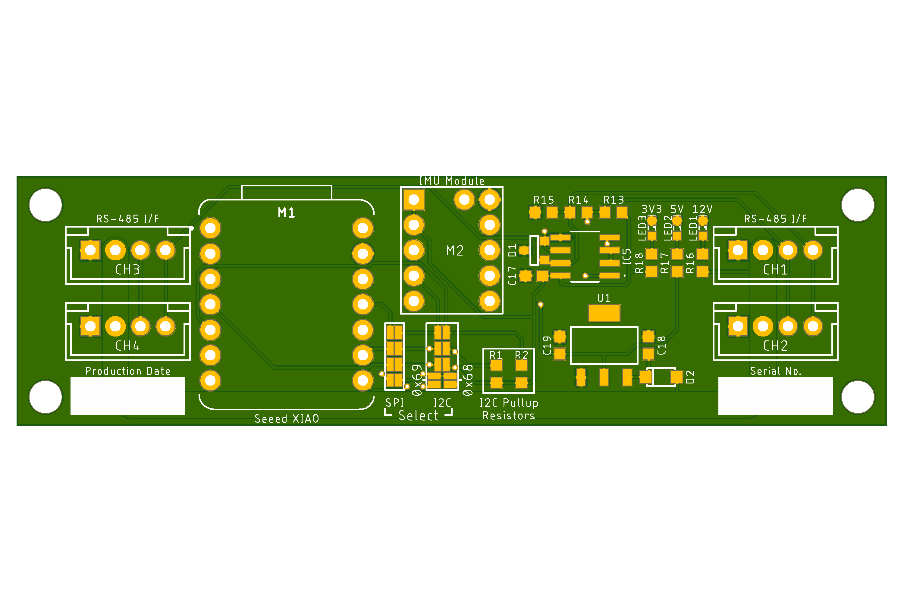
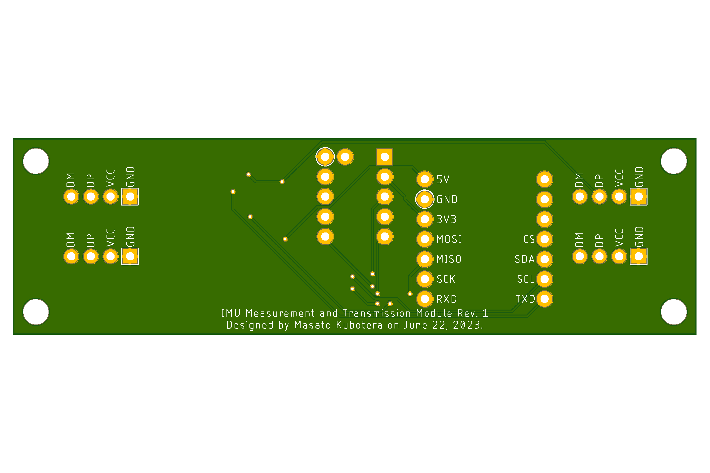

<html lang="en">

<head>
    <meta charset="uft-8">
    <meta name="author" content="Masato Kubotera">
    <meta name="description" content="">
</head>

<body>
    
<strong>This product is currently under development!</strong>

    <h1>IMU Measurement and Transmission Module</h1>
        

            This product is a module enabling the <a href="https://github.com/SUSTAINA-OP/ICM-42688-P-Module">SUSTAINA-OP/ICM-42688-P-Module</a> (IMU module) to be connected to a USB or RS-485 I/F through a microcontroller.  
            The <a href="/firmware">firmware</a> for this product to be written to the microcontroller is a modification of the following library.
            <ul>
                <li><a href="https://github.com/finani/ICM42688">finani/ICM42688</a></li>
            </ul>
            (The firmware of this product currently supports only USB I/F connection.)
        

    <h2>Features Rev. 1</h2>
        

            <table>
                <tr>
                    <th>Top Surface of PCB</th>
                    <th>Bottom Surface of PCB</th>
                    <th>Assembled Electronic Components</th>
                </tr>
                <tr>
                    <td></td>
                    <td></td>
                    <td></td>
                </tr>
            </table>
        

    <h3>PCB</h3>
        

            <ul>
                <li>87mm x 25mm PCB layout</li>
            </ul>
        

    <h2>Development Environments</h2>
    

        This product is designed with the following software.
            <ul>
                <li><a href="https://www.autodesk.com/products/eagle/overview">Autodesk Eagle 9.6.2</a></li>
                <li><a href="https://www.arduino.cc/en/software">Arduino IDE 1.8.19</a></li>
            </ul>
    

    <h2>Repository Contents</h2>
        

            <dl>
                <dt><a href="/images">\images</a></dt>
                <dd>PCB preview images and capture of design screen</dd>
                <dt><a href="/libraries">\libraries</a></dt>
                <dd>Libraries used in Autodesk Eagle design</dd>
                <dt><a href="/pcb_order">\pcb_order</a> </dt>
                <dd>Gerber data and documentation for ordering PCB</dd>
                <dt><a href="/firmware">\firmware</a> </dt>
                <dd>Sample firmware to be written to the microcontroller board</dd>
                <dt><a href="/schematic.pdf">schematic.pdf</a></dt>
                <dd>Circuit diagram of this product</dd>
                <dt>*.brd</dt>
                <dd>Board wiring design file by Autodesk Eagle</dd>
                <dt>*.sch</dt>
                <dd>Circuit diagram design file by Autodesk Eagle</dd>
                <dt><a href="/.gitignore">.gitignore</a></dt>
                <dd>A file that tells Git not to track a particular file</dd>
                <dt><a href="/LICENSE">LICENSE</a></dt>
                <dd>License to use this product</dd>
            </dl>
        

    <h2>Documentation</h2>
    <h3>Documentation</h3>
        

            The following design errors have been identified in Rev. 1 of this product.
            <ul>
              <li>TXDEN of UART/RS-485 conversion IC is not wired to the microcontroller board</li>
                When used with USB I/F, there is no problem, but when used with RS-485 I/F, solder a jumper wire between TXDEN and the microcontroller as shown in the figure below. 
                
            </ul>
        

    <h2>References</h2>
        

        

    <h2>Contact</h2>
        

            If you have any questions, please contact the designer of this product, Masato Kubodera, by <a href="mailto:masato.kubotera@sustaina-op.com">e-mail</a>. 
            E-mail: <a href="mailto:masato.kubotera@sustaina-op.com">masato.kubotera@sustaina-op.com</a>
        

    <h2>License Information</h2>
        

            This product is open source. Please review the <a href="/LICENSE">LICENSE</a> for license information. 
             
            This product by Masato Kubotera is licensed under a <a href="http://creativecommons.org/licenses/by-nc-sa/4.0/">Creative Commons Attribution-NonCommercial-ShareAlike 4.0 International License</a>.
        

</body>
</html>
